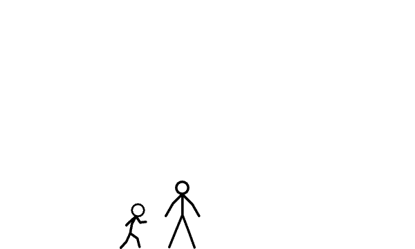

<table border="0">
  <tr>
    <!-- Left Column: GIF -->
    <td width="50%" align="center" valign="middle">
      
    </td>
    <!-- Right Column: Content -->
    <td width="50%" valign="middle">
      <h1>Supp, Rajan here..</h1>
      <h3>..a dev & a creative thinker(tryin...;)</h3>
       
      <!-- <h3>Connect with me:</h3> -->
      

        
        

      

      
    </td>
  </tr>
</table>
